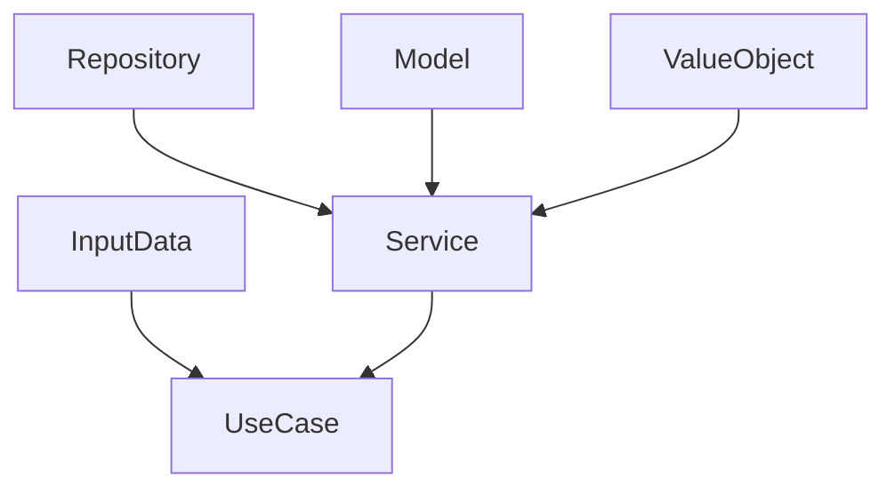
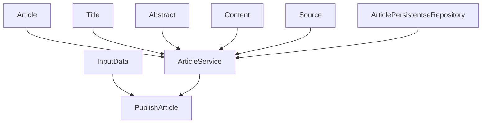

## PyDI
__Publish and Debate Ideas__ (__PYDI__ for it spanish nomenclature) comes to propose a new way of create colective knowleage in a time were fake news are extremly frecuent.

## Table Of Contents
  * [Introduction](#introduction)
  * [Consumers](#consumers)
  * [Developers](#developers)
    * [Architecture](#architecture)
    * [Folder Structure](#folder-structure)
  
## Introduction 
The usual way to avoid bullshit content in the internet by checking its sources and searching for other content which validate it.

__PyDI__ helps in the process adding two simple rules:
  1. An article or a first publication should have sources.
  2. A opinion  about the article or a portionof it must have sources.

The application implements these rules by providing _reactions_ to the articles.

## Consumers 
## Developers  
### Architecture 
This is a [Ports and Adapters Architecture](https://en.wikipedia.org/wiki/Hexagonal_architecture_(software)) build with [Domain-driven Desing](https://en.wikipedia.org/wiki/Hexagonal_architecture_(software)).

At the time this documentation was written there were the following _building block_ in use:
  * Use Cases
  * Domain Model:
    * Service
    * Model
    * Value Objects
  * Infrastructure:
    * Repositories

### Use Cases 
#### PublishArticle

